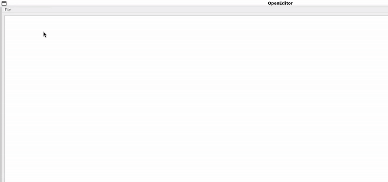
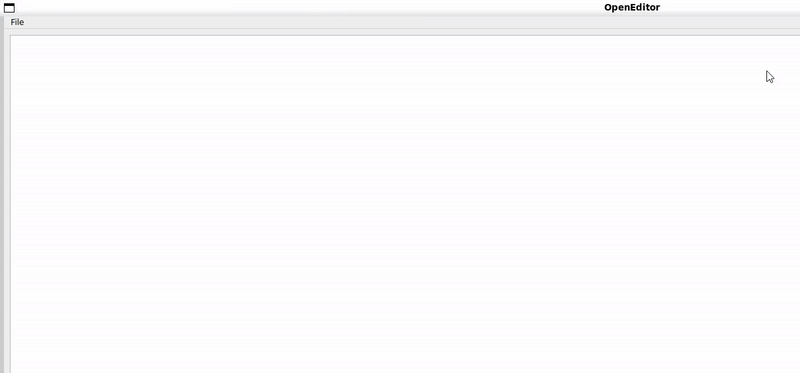
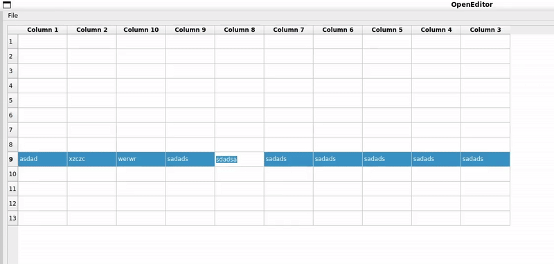
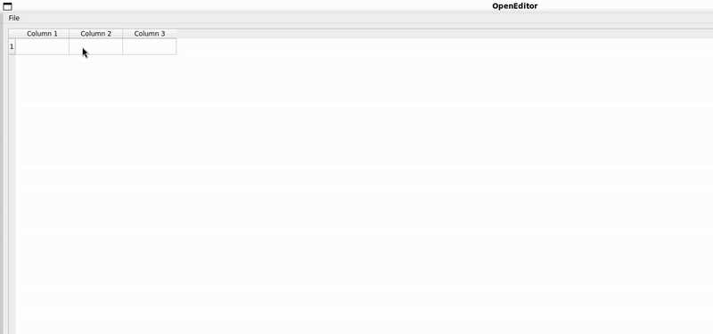

# BlackBoxTable for PyQt6
Are you building a PyQT6 App and looking for a ready-to-use, easy-to-integrate, fully editable table widget for your PyQt6 applications?  

**(づ◡﹏◡)づ Congrats! You have found this repo.**  

This repository provides a table widget with essential features for PyQt6 apps.  

It's not a standalone application—just a plug-and-play table designed for integration into your projects.

You can see example of usage this table widget in your QMainWindow in \blackbox\example.py

#### Features

Save/Load/Create tables  
  
  

Drag and drop rows  
  

Row / Column management  
  

  - Find & Replace  

#### Shortcut support
All shortcuts are customizable via `blackbox/app/static/namespace/shortcuts.json`:

```json
{
    "bar": {
        "file_menu": {
            "upload": "Ctrl+O",
            "save": "Ctrl+S",
            "new_table": "Ctrl+N"
        }
    },
    "table" : {
        "add_row_above" : "Ctrl+Up",
        "add_row_below": "Ctrl+Down",
        "remove_row": "Ctrl+Delete",

        "add_column_after" : "Ctrl+Right",
        "add_column_before": "Ctrl+Left",
        "remove_column": "Ctrl+Shift+Delete",

        "replace": "Ctrl+R",
        "find": "Ctrl+F"
    }
}
```

## Project tree

```bash
blackbox/                # Main source directory
│
├── example.py           # File for representing example of usage  
│
├── app/                 # Core application logic and components  
    │
    ├── bar/             # Bar module for various application tools
    │
    ├── static/          # Static assets and dependencies  
    │   │
    │   ├── imgs/        # Directory for storing images, including logos and icons  
    │   │
    │   └── namespace/   # Namespace for labels, shortcuts, or other reusable elements  
    │
    └── table/           # Module for table-related features and views  
        │
        └── dialogs/     # Dialog components for user interactions and prompts  
```


## Installation & Usage

```bash
git clone https://github.com/HarutyunAg/blackbox-pyqt6-table.git

cd blackbox-pyqt6-table

uv sync

uv run main.py
```

## Linux Wayland Support

When running on Linux, you might encounter:

```
    Failed to create wl_display (No such file or directory)  
    qt.qpa.plugin: Could not load the Qt platform plugin "xcb" or "wayland"  
```
Solution:  
    Install the missing Qt Wayland package:  

```bash
sudo apt install qtwayland5
```
